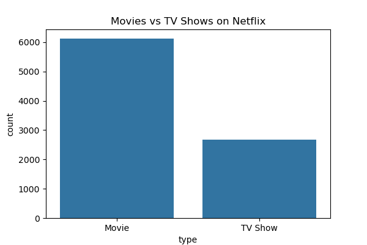
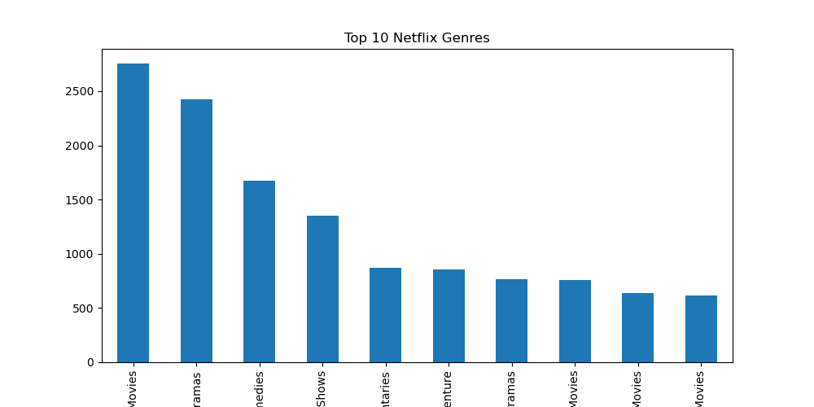
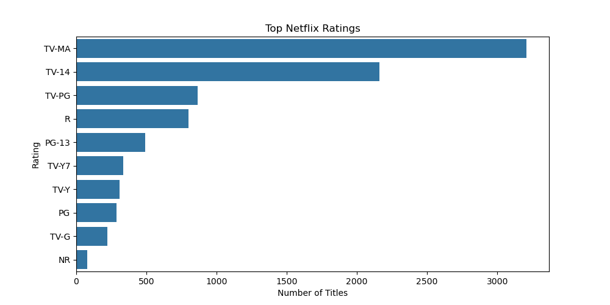
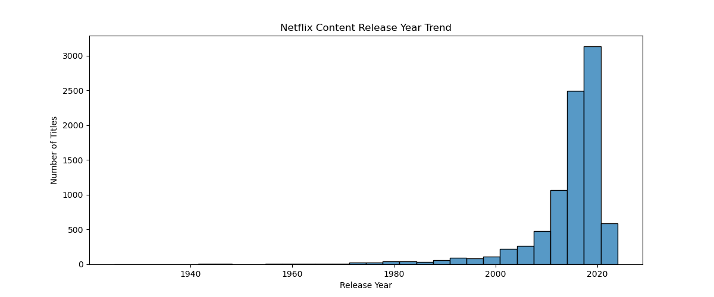

## 📊 Project Screenshots

### 1. Content Type Analysis

### 2. Movies vs TV Shows

### 3. Genre Analysis

### 4. Top Genres

### 5. Top Countries

### 6. Rating Analysis

### 7. Ratings Distribution

### 8. Netflix Growth

### 9. Release Year Trend

