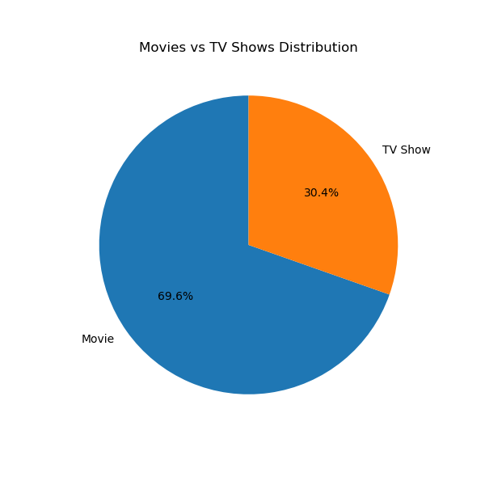
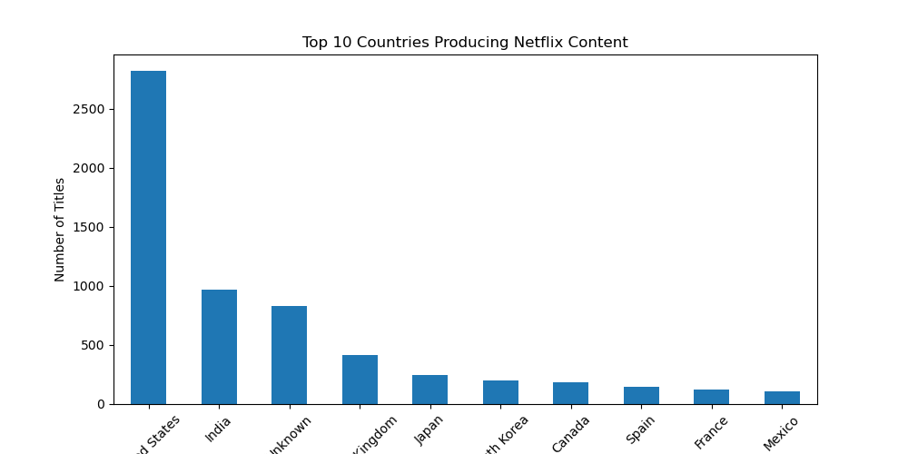
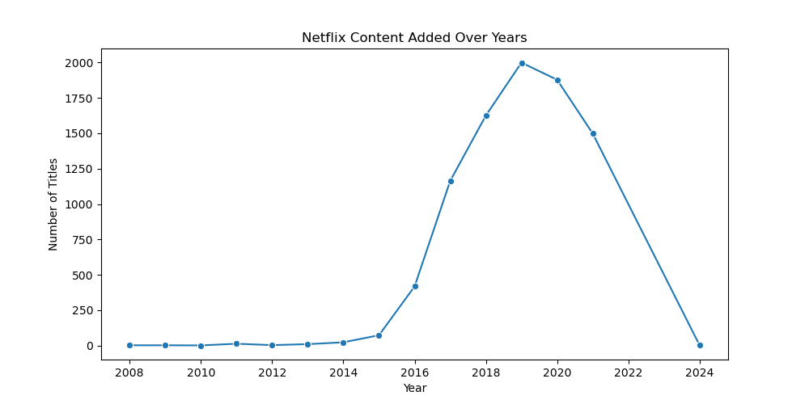
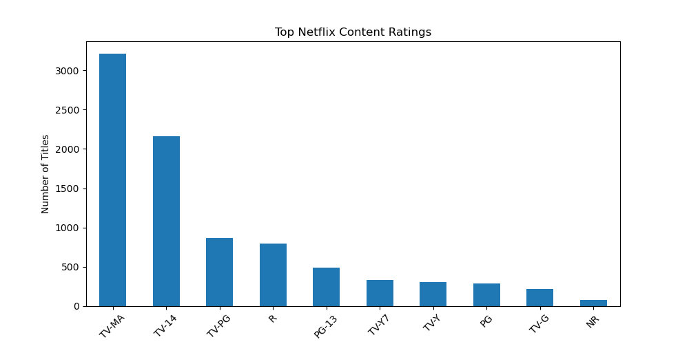
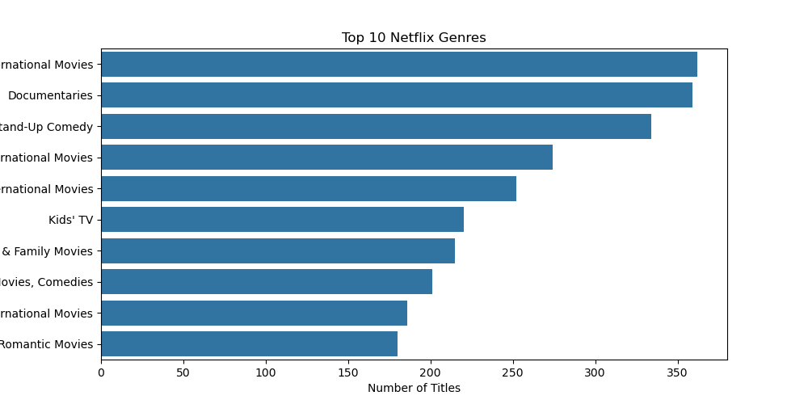

# 🎬 Netflix Data Analysis & Interactive Dashboard

## 📌 Project Overview

This project performs Exploratory Data Analysis (EDA) on the Netflix Movies and TV Shows dataset using Python.

The project analyzes Netflix content distribution, countries, release trends, ratings, and genres.

An interactive **Streamlit dashboard** was also developed to allow users to explore the dataset using filters and visualizations.

---
## 🚀 Live Demo

👉 [View Live Netflix Dashboard](https://netflix-data-analysis-mctxwbhsdfid7shktmg8mk.streamlit.app/)

## 🎯 Project Objectives

- Analyze Movies vs TV Shows distribution
- Identify top content-producing countries
- Analyze Netflix content growth over the years
- Study Netflix content ratings
- Identify the most common genres
- Provide an interactive dashboard for data exploration
- Allow users to download filtered data

---

## 🛠️ Technologies Used

- Python
- Pandas
- NumPy
- Matplotlib
- Seaborn
- Plotly
- Streamlit
- Jupyter Notebook
- Git & GitHub

---

## 📂 Dataset

**Netflix Titles Dataset**

The dataset contains information about:

- Title
- Type
- Director
- Cast
- Country
- Date Added
- Release Year
- Rating
- Duration
- Genres
- Description

---

## 🔄 Project Workflow

```text
Data Collection
      ↓
Data Cleaning
      ↓
Handling Missing Values
      ↓
Data Preprocessing
      ↓
Exploratory Data Analysis
      ↓
Data Visualization
      ↓
Interactive Streamlit Dashboard
      ↓
Insights Generation

---

# 📊 Key Analysis

## 1. Movies vs TV Shows

Analyzed the distribution of Movies and TV Shows available on Netflix.



---

## 2. Top Countries

Identified the top countries producing Netflix content.



---

## 3. Netflix Content Growth

Analyzed Netflix content growth based on release year.



---

## 4. Rating Analysis

Analyzed the distribution of Netflix content across different ratings.



---

## 5. Top Genres

Identified the most common genres available on Netflix.



---

# ⭐ Interactive Streamlit Dashboard

An interactive dashboard was developed using Streamlit to make the Netflix analysis easier to explore.

### Dashboard Features

- 🎛️ Content Type Filter
- ⭐ Rating Filter
- 🔢 Dynamic KPI Cards
- 📋 Dataset Preview
- 📊 Movies vs TV Shows Visualization
- 🌍 Top 10 Countries Visualization
- 📈 Netflix Content Growth Trend
- ⭐ Rating Analysis
- 🎭 Top 10 Genres
- ⬇️ Download Filtered Dataset

### Dashboard Preview

The dashboard allows users to interact with Netflix data using filters and dynamically updated charts.

---

# 📁 Project Structure

```text
Netflix_Data_Analysis/
│
├── app.py
├── netflix_analysis.ipynb
├── netflix_titles.csv
├── README.md
│
└── images/
    ├── content_type.png
    ├── genre_analysis.png
    ├── movies_tv_distribution.png
    ├── netflix_growth.png
    ├── rating_analysis.png
    ├── ratings.png
    ├── release_year_trend.png
    ├── top_countries.png
    └── top_genres.png

    
### 4. How to Run

```markdown
---

# ▶️ How to Run the Project

### Step 1: Clone the Repository

```bash
git clone https://github.com/shirishamuntha2005-boop/Netflix-Data-Analysis.git
